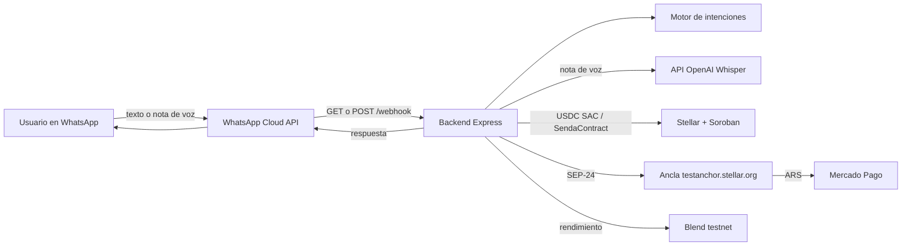
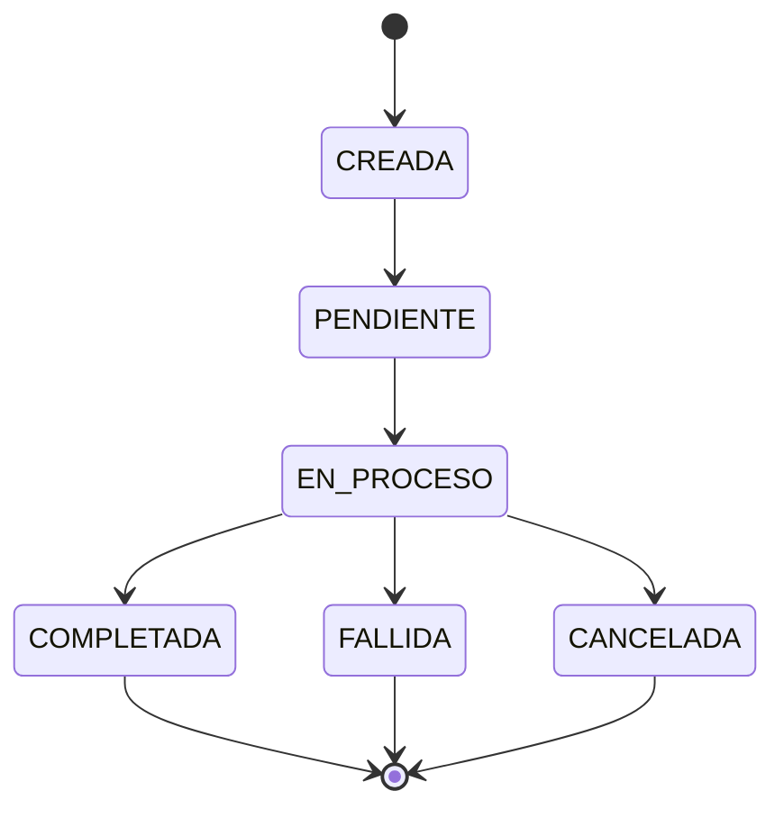
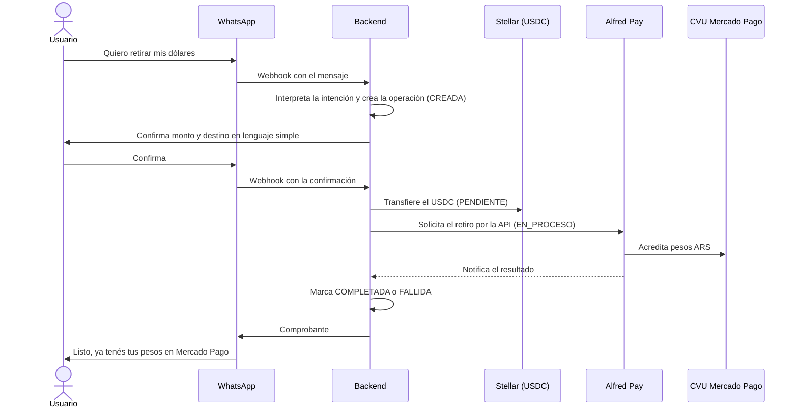
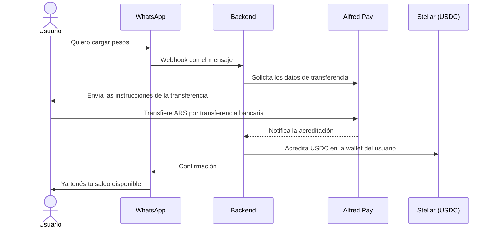
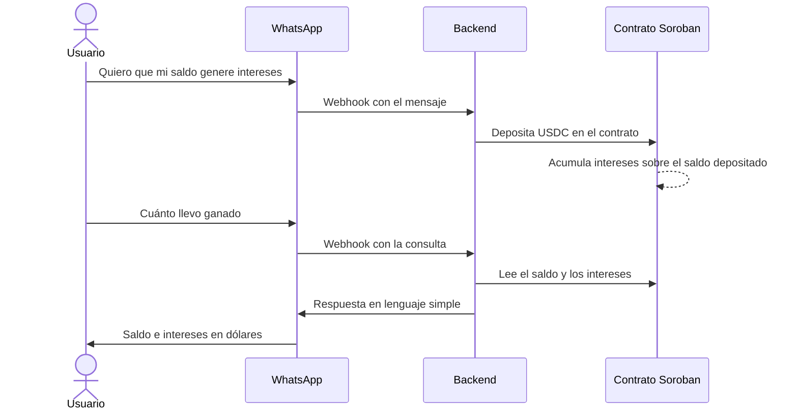
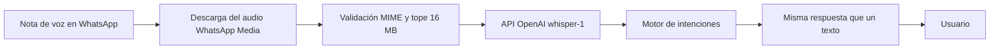

# Senda
> Envía lo que importa. En segundos, estés donde estés.

Senda es un agente de IA conversacional en WhatsApp, en español y ingles,self-custodial que abstrae por completo la complejidad de moverse entre pesos argentinos y USDC sobre Stellar. El usuario nunca ve una clave, una dirección ni un hash solo escribe (texto o nota de voz) y la plata se mueve.

- Aplicación en vivo: https://withsenda.site/
- Documentación: https://withsenda.site/docs (Actualizada el 22/09 por lo que aun nos quedo un poco desactualizada a lo actual)

## Problema
Los freelancers, creadores y trabajadores independientes en América Latina pierden hasta un 10% o más de sus ingresos en comisiones abusivas, demoras de varios días y burocracia bancaria tradicional cuando intentan cobrar desde el exterior hacia sus cuentas locales.

Cada vez más profesionales cobran del exterior sin haberse ido del país. Según Bitwage by Paystand, casi el 40% de esos pagos en su plataforma van a profesionales ubicados en Argentina. Un diseñador que trabaja para una startup de Estados Unidos, un desarrollador contratado por una empresa europea, una consultora que presta servicios a clientes internacionales: ese dinero cruza fronteras de una forma muy parecida a una remesa tradicional.

Las stablecoins como USDC resuelven el problema de velocidad y costo, pero obligan al usuario no cripto a lidiar con wallets complejas, frases semilla, redes y gas fees como XLM, lo que frena la adopción masiva. Los canales tradicionales de pago internacional, como las transferencias bancarias o las plataformas intermediarias, son lentos y caros. Y operar con dinero en blockchains públicas expone los datos financieros del usuario a la vista de cualquiera, lo que desalienta su uso cotidiano o comercial serio sin cumplimiento normativo ni privacidad patrimonial.

# Solucion 
Nuestra solución es una puerta de entrada financiera diseñada para abrir el Economía global para cualquiera, en cualquier lugar. Hemos construido un chatbot de WhatsApp en español y ingles,self-custodial impulsado por stablecoins USDC sobre la blockchain Stellar, para resolver esto. Abstraemos la complejidad cripto y la metemos dentro de WhatsApp, generando confianza a través de una interfaz familiar mientras usamos la blockchain por debajo para la velocidad y el bajo costo. Sin apps nuevas, sin wallets que configurar, sin frases semilla, sin gas fees que manejar: el usuario manda un mensaje y el dinero llega, liquidado directo en Mercado Pago. Facilitando cobrar pagos de clientes de todo el mundo, y mover dinero a través de fronteras sin fricciones. Desde transferencias globales instantáneas hasta fluidas Gasto local, Queremos ofrecer las herramientas bancarias de primer nivel que necesitas para ganar a nivel global y gastar localmente, Sin concesiones. Ademas el usuario podrá tener la decision de poner su plata a rendir y ahorrar a partir de tan solo 2 dólares, esto hace que en un futuro pueda tener parte de su retiro solo con los rendimientos que le va dando, pudiendo sacar su plata cuando la necesite.


## ¿Qué hace diferente a senda?

Casi todas las billeteras de *stablecoins* diseñadas para mercados emergentes exigen una de dos
concesiones: ceder el control de los fondos a la empresa que opera la aplicación, o
gestionar la conversión a moneda local mediante una integración cerrada y propietaria con un único proveedor,
lo que deja al usuario sin visibilidad sobre qué sucede con su dinero mientras está en tránsito. Senda elimina ambos problemas. La billetera del usuario está integrada y es de self-custodia: el usuario es el verdadero propietario criptográfico desde el primer mensaje, no simplemente un cliente de un custodio. La conversión ARS↔USDC se ejecuta sobre SEP-24 —el protocolo abierto y estandarizado de Stellar para depósitos y retiros gestionados—, ofreciendo estados de transacción legibles que el agente de IA explica al usuario en tiempo real, en lugar de dejarlo esperando una respuesta de soporte.

| | Senda | La mayoría de las billeteras de *stablecoins* basadas en chat |
|---|---|---|
| **Custodia** | Una cuenta Stellar por persona, integrada mediante Privy. Senda no almacena la frase semilla; firma utilizando una clave de sesión delegada por el usuario durante el registro. | La empresa controla las claves; custodia centralizada |
| **Liquidación en moneda fiat** | Protocolo abierto (SEP-24) a través de un *anchor* regulado | API cerrada y propietaria de un único proveedor |
| **Salida a moneda fiat en Argentina** | Directo al CVU de Mercado Pago del usuario | A menudo sin solución |
| **Rendimiento** | Blend v2, préstamos en Soroban. En Senda, la posición *on-chain* pertenece a la tesorería, mientras que la participación de cada individuo se registra dentro de Senda. Los fondos pueden retirarse. | Producto financiero propietario; el motor de rendimiento carece de transparencia |
| **Cobros** | Enlace SEP-7. El pago en USDC es directo. Una vez enviado, la liberación de los fondos no puede quedar sujeta a condiciones. | Pago directo e irreversible. |
| **Privacidad** | Hoja de ruta activa hacia Tokens Confidenciales / Pagos Privados en Stellar | Historial de transacciones y saldos expuestos por defecto |

## Estado actual

Senda se encuentra en fase de desarrollo activo en la red de pruebas (Testnet) de Stellar. En el repositorio `senda-backend`, el flujo de trabajo de WhatsApp ya es funcional a nivel de código: mensajes de texto y notas de voz, consulta de saldos, transferencias de USDC, solicitudes de pago SEP-7, registro inicial en la billetera (*onboarding*) y ahorros en Blend. El puente SEP-24 apunta al *anchor* de pruebas `testanchor.stellar.org`: el bot se autentica mediante SEP-10, inicia el flujo del *anchor* y proporciona actualizaciones de estado a través de WhatsApp. No existe un CVU (cuenta virtual) de Mercado Pago vinculado. Alfred Pay y Ripio Ramps aparecen como candidatos en el código, no como clientes activos. Blend v2 está integrado en la red de pruebas: la tesorería deposita fondos en el *pool* y la participación de cada persona se registra en Senda. Cuando se recibe un pago, el bot ofrece la opción de reservar una parte de los fondos. El siguiente hito identificado en los repositorios —que aún no se ha desarrollado— es un programa piloto que incluya una salida a pesos en el mundo real.

## Repositorios

**[`senda-backend`](#)** El producto —bot de WhatsApp (Cloud API v22), registro web (`web-setup`) e integraciones con Stellar— desarrollado en TypeScript. Este repositorio gestiona SEP-7 para cobros, SEP-10 para autenticación con el *anchor*, SEP-24 para retiros, USDC mediante el contrato de activos de Stellar e integración de rendimientos de Blend v2. **[`senda.app`](#)** es el *frontend*.

En testnet el backend usa el Stellar Asset Contract de USDC `CDT2MY3QNV2RT2XULQWWXX2JELUWRWNXNKONCYG5MTIGZM7G5S2QNNGB` (`USDC_SAC_CONTRACT_ID`). El contrato Soroban propio (`SendaContract`, `STELLAR_CONTRACT_ID`) registra créditos y saldos (`ping`, `credit`, `balance`);

## Enlaces

- Aplicación en vivo: https://withsenda.site/
- Documentación: https://withsenda.site/docs (Actualizada el 22/09 por lo que aun nos quedo un poco desactualizada a lo actual)

## Por qué ahora

El objetivo es evolucionar de un servicio de remesas y pagos a un ecosistema financiero completo, integrando tecnología blockchain y stablecoins para ofrecer rapidez, transparencia y valor adicional en cada interacción. El foco no está solo en mover dinero, sino en convertir cada transacción en una oportunidad de generar servicios financieros accesibles, seguros y escalables para los usuarios en Argentina y el exterior.

El futuro de las remesas no debería medirse por el número de transferencias depositadas en cuentas o pagadas directamente en efectivo. Una medida mucho más informativa es la proporción de fondos que permanecen activos dentro de los ecosistemas digitales financieros. Cada remesa digital no es un fin en sí misma, sino el inicio de un círculo virtuoso de inclusión, resiliencia y crecimiento local. La verdadera transformación ocurre cuando el dinero que llega permanece, circula y genera oportunidades.

A esto se suma que Argentina ya tiene, del lado fiat, un riel interoperable maduro (Transferencias 3.0 del BCRA, con CVU/CBU/Alias intercambiables) — la pieza que falta no es velocidad de liquidación fiat, es el puente confiable y regulado entre ese riel y USDC. Eso es
exactamente lo que un anchor SEP-24 resuelve.

El ecosistema Stellar ya tiene un caso de éxito que valida este patrón a escala de mercado (WhatsApp → USDC → efectivo local), y ese jugador está expandiendo agresivamente sus corredores en Latinoamérica con capital fresco, sin haber entrado todavía a Argentina. Es una ventana de tiempo: quien construya primero la pieza de infraestructura consumer-facing de Stellar en Argentina se queda con la posición de entrada.

## Competencia rápida

| | Senda (objetivo) | Félix Pago | Peanut |
|---|---|---|---|
| Interfaz | WhatsApp | WhatsApp | Link (WA/SMS/mail) + QR |
| Last mile en Argentina | Mercado Pago | No opera (roadmap sin AR) | Mercado Pago / banco AR |
| Settlement | Stellar (invisible) | Stellar (USDC) | Solana + EVM (no Stellar) |
| Privacidad de monto | Sí (Confidential Token, MVP/testnet) | No es el wedge público | No es el wedge público |
| Cobertura AR | Entrada / piloto | Ausente hoy | Presente |
| Costo al usuario | A definir con el off-ramp local | Remesa WA competitiva vs. WU | Bajo / $0 en varios flujos QR |
| Riesgo competitivo | — | Capital para expandir a AR | Ya local, otro rail |

Félix Pago: unicornio (~US$1.400M), Serie C de US$200M (sept. 2026, equity liderado por a16z + deuda de General Catalyst), US$8.000M+ procesados, 11 países.

Fuentes de contexto de mercado (no son prueba de tracción de Senda): DATAPAIS/The Dialogue vía Infobae, ONU-Banco Mundial, INE España, BBVA Research, cobertura de la Serie C de Félix (Crunchbase/LatamList, sept. 2026), sitio de Peanut, Bitwage by Paystand, y el informe "Remesas 2030" (Mastercard x CrossTech).

## Go-to-market

**A quién nos dirigimos primero.** Freelancers y trabajadores remotos en Argentina que cobran de
clientes del exterior (desarrollo, diseño, traducción, consultoría) y ya usan Mercado Pago todos los
días. Las PyMEs vienen después, con Senda Business.

**Cómo llegamos.** Comunidades de freelancers y devs argentinos, contadores que asesoran a
profesionales independientes, contenido con demos reales del flujo, y el ecosistema Stellar
(BAF, Meridian). El crecimiento se apoya en los links de cobro: cada pago le muestra Senda a un
nuevo cliente.

 **Atraer remitentes con corredores co-marcados (meses 0-3).**
* Una vez que las solicitudes están fluyendo, pasamos a la adquisición por parte de la diáspora
* Demos en directo de influencers en TikTok/Instagram mostrando "Mira cómo envío 50 dólares en 40 segundos."

**Fases.**
1. **Validación** (hoy, en testnet): sesiones grabadas con freelancers reales para verificar que
   completan el flujo sin ayuda.
2. **Beta cerrada:** montos chicos, con un socio regulado para la liquidación en pesos.
3. **Crecimiento:** referidos, contadores y comunidades.
4. **Senda Business:** equipos, tesorería y privacidad.

**Qué medimos.** Dólares liquidados a Mercado Pago, usuarios que completan su primer retiro y
usuarios que vuelven.

## PLAN DE COMERCIALIZACIÓN
1. REDES SOCIALES Y MARKETING DE CONTENIDOS

### Objetivo: Crear conciencia de marca y educar a los usuarios sobre las características de Senda, centrándose en las billeteras USDC, KYC y las soluciones de pago.
* Vídeos cortos
### Contenido:
* Educativo (por ejemplo, "¿Qué es el USDC y por qué usarlo?").
* Promocional (por ejemplo, "Cómo activar su billetera USDC").
* Compromiso (por ejemplo, "Bill Splitting Challenge" para usuarios jóvenes).
### Plataformas:
* TikTok/Instagram Reels: clips de 15-30 segundos.
* YouTube: tutoriales de 5-10 minutos (por ejemplo, "Completar KYC en 3 pasos").
* Frecuencia: 3-4 vídeos por semana.
* Publicaciones sociales y correos electrónicos quincenales
* Publicaciones sociales: Comparta historias de usuarios, actualizaciones de funciones y consejos financieros; use encuestas y preguntas y respuestas en vivo para participar.
* Correos electrónicos: Segmente a los usuarios (por ejemplo, estudiantes, comerciantes, ahorradores de grupo) y envíe contenido personalizado como guías de incorporación u ofertas exclusivas.
* Frecuencia: Quincenal para ambos.
* Publicaciones semanales de blog
### Contenido: Guías sobre herramientas financieras, beneficios de USDC y casos de uso de Senda (por ejemplo, "Cómo los ahorros pueden ayudarle a ahorrar más").


## 2. ESTRATEGIA DE VENTAS PARA PEQUEÑOS COMERCIANTES

### Objetivo: A bordo de los comerciantes pequeños a Senda Business para la facturación y los pagos, destacando los acuerdos instantáneos y las bajas tarifas.
## Tácticas en persona:
* Los agentes de campo demuestran la aplicación en los mercados.
* Cabinas emergentes en ferias comerciales para inscripciones.
### Tácticas en línea:
* Seminarios web quincenales sobre facturación y pagos.
* Tutoriales en vídeo en YouTube y redes sociales.
### Propuesta de valor:
* Pagos instantáneos con tarifas bajas.
* Prueba gratuita de 30 días con facturas ilimitadas para Senda Business.

## Arquitectura técnica

### Componentes

| Componente | Tecnología | Rol |
|---|---|---|
| Landing | Next.js 15, React 19, Tailwind 4, next-intl | Marketing y pitch en Senda.App |
| Backend | Node.js (>= 22.12.0) / TypeScript / Express | Webhook de WhatsApp, motor de intenciones, transcripción, orquestación |
| Transcripción | API de OpenAI (`whisper-1`) | Nota de voz → texto |
| Capa blockchain | Stellar (USDC SAC) + `SendaContract` en Soroban | Settlement, crédito y saldo |
| Rendimientos | Blend (testnet) | Supply / consulta / withdraw de USDC |
| Off-ramp Mercado Pago | SEP-24 contra `testanchor.stellar.org` | Retiro interactivo a Mercado Pago |
| Interfaz de chat | WhatsApp Cloud API (`v22.0`) | Canal del usuario |

### Cómo interactúan



### Piezas

- **Bot de WhatsApp:** WhatsApp Cloud API (versión `v22.0` por defecto). El backend expone `GET /webhook` para la verificación de Meta y `POST /webhook` para los mensajes, que se validan con la firma `X-Hub-Signature-256` usando el App Secret de Meta. También sirve `GET /health` y `GET /media/welcome.mp4`.
- **Wallet:**
  - Diseño: no-custodial (passkey / smart wallet Soroban).
  - Hoy: custodia invisible SEP-30; Privy MPC solo si `USE_PRIVY_WALLETS=true`.
- **Off-ramp:** Mercado Pago vía SEP-10 + SEP-24 (ancla de test).Alfred Pay es la pasarela prevista, no un cliente en el código.
- **Relación entre senda-backend y Senda.App:** despliegues separados. La landing no llama al backend.

## Flujos

### Máquina de estados del producto

Diseño: CREADA → PENDIENTE → EN_PROCESO → COMPLETADA / FALLIDA / CANCELADA, con idempotencia.



Cada transición es idempotente: reintentar el mismo mensaje o la misma llamada no duplica la operación.


### Flujo de retiro (Off-Ramp)

Diseño: retiro de USDC por WhatsApp hasta que los ARS se acreditan en el CVU de Mercado Pago vía la API de Alfred Pay.



Hoy: el retiro a Mercado Pago funciona por SEP-24 contra `testanchor.stellar.org`;

### Flujo de ingreso (On-Ramp)

Diseño: transferencia de pesos convertida automáticamente a USDC sobre Stellar, vía Alfred Pay.



Hoy: no hay on-ramp implementado.

### Flujo de rendimientos

Diseño: contratos Soroban que generan intereses pasivos en dólares digitales, comunicados al usuario en lenguaje simple.



Comunicación al usuario: los intereses se informan en dólares y sin términos técnicos (nada de pools, APY, gas ni contratos). El usuario ve cuánto tiene y cuánto ganó, y puede retirar cuando quiera con el flujo de retiro.

Hoy: el rendimiento funciona contra un pool de Blend en testnet (`SupplyCollateral` / `WithdrawCollateral`).

### Arquitectura de IA y voz

**Motor de intenciones.** Cada mensaje de texto pasa por `intent.service.ts`, que clasifica lenguaje natural en español y decide la acción: saldo, enviar USDC, retiro en efectivo, retiro a Mercado Pago, rendimiento (poner, consultar, sacar) o menú. Si falta un dato (por ejemplo el monto o la red de efectivo), el bot lo pide en la misma conversación antes de ejecutar.

**Pipeline de notas de voz.**

Diseño: Whisper ejecutado de forma local.

Hoy: la transcripción funciona con Whisper (whisper-1) a través de la API de OpenAI, y requiere `OPENAI_API_KEY`.



1. El webhook recibe el mensaje de audio y descarga el archivo desde WhatsApp Media.
2. Se valida el MIME y se rechaza si supera 16 MB.
3. Mandamos el audio a `https://api.openai.com/v1/audio/transcriptions` (`OPENAI_API_KEY`, modelo `whisper-1` por defecto, idioma `es`).
4. El texto entra al mismo motor de intenciones que un mensaje escrito.
5. El bot responde con la misma intención.

## Stack

- Next.js 15
- React 19
- Prisma
- tRPC
- NextAuth
- Tailwind 4
- next-intl

La landing usa Next.js/React/Tailwind/next-intl. Prisma/tRPC/NextAuth están disponibles en el stack; su rol final depende de cómo se conecte Senda.App con senda-backend.

## Cómo correr el proyecto

### Landing (Senda.App)

```bash
git clone https://github.com/SendaLabs/Senda.App.git
cd Senda.App
npm install
cp .env.example .env    # en Windows (cmd): copy .env.example .env
npm run dev
```

`DATABASE_URL` es obligatorio al arrancar (Next valida el entorno al cargar la config) aunque la landing no la use en runtime. En `.env.example` el valor de desarrollo es `file:./db.sqlite`.

Otros scripts:

```bash
npm run build
npm start
npm run db:push
npm run lint
```

Scripts:

| Script | Qué hace |
|---|---|
| `npm run dev` | Servidor en desarrollo con recarga (nodemon + ts-node) |
| `npm run build` | Compila TypeScript a `dist/` |
| `npm start` | Ejecuta `dist/index.js` |
| `npm run typecheck` | Verifica tipos sin compilar |
| `npm test` | Corre los tests de `src/services/*.test.ts` |
| `npm run contract:build` | Compila el contrato Soroban (`stellar contract build`) |
| `npm run contract:deploy` | Despliega el contrato (`scripts/deploy-contract.js`) |

## Hoja de ruta
 
| Fase | Alcance | Estado |
|---|---|---|
| Fase 1 — Senda (personas) | Onboarding invisible, wallet self-custodial, envío/recepción P2P, retiro a Mercado Pago vía SEP-24, yield vía Blend, links de cobro SEP-7| `[COMPLETAR]` |
| Fase 2 — Senda Business | Dashboard web, tesorería con multisig (Trustless Work multi-release), pagos masivos, tarjetas corporativas, gestión de facturas | Roadmap — Meridian |
| Fase 3 — Privacidad | Confidential Tokens / Stellar Private Payments para tesorería empresarial, selective disclosure para compliance | Roadmap técnico |
| Fase 4 — Pagos de agentes | x402 para pagos autónomos agente-a-agente en el mercado de habilidades de Senda Business | Roadmap exploratorio |

1. Integración de MoneyGram Los usuarios pueden intercambiar instantáneamente USDC a efectivo a través de las ubicaciones de MoneyGram o efectivo en dinero fiduciario por USDC.

Cómo se utiliza Stellar: Stellar USDC sirve como puente para una conversión rápida y de bajo coste entre el efectivo digital y el físico.

Impacto: Mejora drásticamente la accesibilidad para usuarios no bancarizados o con pocas bancaris, impulsando un mayor volumen de transacciones y un uso repetido.

2. Stellar Anchor para Argentina (ARS) Un Stellar Anchor completo que soporta programática (SEP-6) y alojamiento (SEP-24) para la rampa de acceso/salida entre Ars y USDC, incluyendo servicios de presupuesto (SEP-38) y pagos transfronterizos (SEP-31).

Cómo se utiliza Stellar: Senda actúa como una pasarela de acceso y salida con licencia en la red Stellar, permitiendo que monederos y aplicaciones se conecten directamente para los flujos GHS <> USDC.

Impacto: Genera ingresos significativos a través de comisiones, mientras resuelve problemas de liquidez y posiciona a Senda como un actor clave en la infraestructura del ecosistema Stellar.

## Hitos

| Fecha | Hito | Criterio de listo |
|---|---|---|
| 20/09 | Hito 1 | Contrato en testnet responde aprobar/rechazar con datos de prueba |
| 24/09 | Hito 2 | Mensaje real de WhatsApp dispara el flujo completo hasta pago o rechazo |
| 27/09 | Entrega final | Todo estable + pitch deck + demo |

Riesgos: el Confidential Token previsto depende de SDKs en Developer Preview (alcance en testnet); la custodia SEP-30 y los secretos de vault son superficie nueva para nosotros; el off-ramp a Mercado Pago depende del ancla SEP-24 de test; el efectivo es simulado; el on-ramp y Alfred Pay todavía no están en el backend.

## Validación con usuarios externos

Antes de la entrega del Argentina Builder Challenge (27/09/2026), personas ajenas al equipo fundador probaron el bot de WhatsApp de Senda sobre Stellar testnet. Los testers están anonimizados (nombres, países y teléfonos omitidos).

| Métrica | Valor |
|---|---|
| Testers con flujo documentado | 5 |
| Cuentas de usuarios registradas (sin cuentas del equipo fundador) | 5 |
| Wallets creadas durante la prueba (una por cuenta) | 5 |
| Acreditaciones de USDC con comprobante on-chain | 2 |
| Respuestas de formulario | 2 (ambas: "se sintió como una transferencia normal" y "ya lo usaría") |

Wallets creadas:
- GBROFG7RITQUXRDIYSOVW4YJWQ6BQDNA6JBB4QIJBZC3XANS2VU3MFYE
- GA6GX64RR7PPWFUQGKVSO7DK3EFSEYNFO3RNP2ABVYL6ZNUX4OXYOIXD
- GCZBHGRNZEOLDY6TZA6J6KXKQUEKLCM36MSJZBQNBN2FNOVVSYJ7AGJE
- GDV2DLPYODVENPY7DZHQ6RHKETVMB77PQOPZSMX5XDJYMQX5TP7R45MW
- GCW5CGJ36GMHXT5FU3G2ZELJZIK43ZAYEPZFAABVRFTKT6R4NHSGH6MZ

| Tester | Flujo probado |
|---|---|
| Tester 1 | Consulta de saldo e inicio de envío ("Mandar 10"): el bot pide un destino real (teléfono, CVU, alias o link de cobro) |
| Tester 2 | Generación de link y QR de cobro; el QR abre WhatsApp con el mensaje listo para quien paga |
| Tester 3 | Dos acreditaciones de USDC (10 y 5) con comprobante en stellar.expert; saldo final 13 USDC; el bot propone apartar 2 USDC a ahorro con una estimación referencial |
| Tester 4 | Envío a un destinatario nuevo: el bot registra el número y pide CVU/alias, link de cobro o que abra cuenta, porque aún no tiene wallet |
| Tester 5 | Usuario del perfil objetivo (recibe remesas, usa Western Union, sin experiencia previa en cripto): formulario con facilidad 5/5, claridad de cobro 10/10 |

**Verificación on-chain (testnet):** [acreditación de 10 USDC](https://stellar.expert/explorer/testnet/tx/db59b6f995364632fd13ebe365a0e9db5eb918f25e64edb51f60d6c7564aea5c) · [acreditación de 5 USDC](https://stellar.expert/explorer/testnet/tx/dfe844263711a8d49eb2db8b0a7c0177d2607d0145a3e49a0efc690b910ed5b4)

**Límites:** muestra chica y cercana al equipo, pensada para validar que el flujo funciona y se entiende, no para conclusiones de mercado. Todo ocurre en testnet; el retiro a Mercado Pago está simulado y la estimación de ahorro es referencial.

Documento completo con capturas anonimizadas: [Google Doc](https://docs.google.com/document/d/11j4aj7V71qWfGHbjxLrVte-cavvZfx8FfrgcsekkwD4/edit?usp=sharing)

## Documentación
Pitch (Argentina Builder Challenge): https://docs.google.com/document/d/1Q49nLCfl-VOjWNQluKXtgg08m6D_J819PBCLaIwA4A0/edit?tab=t.0
Pitch Deck (Argentina Builder Challenge): https://docs.google.com/presentation/d/1do1UYuHVPNFeT5q73hg-zqoBYkwjHBqfkWqDd4CdV1U/edit?usp=sharing
Evidencia de usuarios externos (Argentina Builder Challenge): https://docs.google.com/document/d/11j4aj7V71qWfGHbjxLrVte-cavvZfx8FfrgcsekkwD4/edit?usp=sharing

## Roadmap global

1. **Piloto de remesas Argentina** — validar el flujo WhatsApp → Confidential Token → Mercado Pago con datos reales, más allá del demo.
2. **Extensión de privacidad** — Stellar Private Payments para ocultar también remitente/destinatario, cuando salga de Developer Preview.
3. **Expansión de corredores** — otros países LATAM con adopción alta de stablecoins y sin cobertura de Stellar consumer-facing.
4. **Senda Business** — ver sección siguiente.

## Senda Business: pagos para empresas a través de fronteras

Nuestra tesis de fondo es un Financial Operations Platform para pymes de LATAM, con wedge de entrada en Accounts Payable: factura → aprobación → pago → conciliación. El ADN de "fondos por proyecto/presupuesto" (Fund/Project/Budget) es el diferenciador de ontología frente a plataformas tipo Ramp (Company → Department → Employee).

Senda Ledger unifica bancos, stablecoins y tarjetas sin obligar a mover fondos a cripto. El Payment Router decide la mejor ruta de pago (banco, stablecoin, riel local) componiéndose sobre partners de ruteo ya existentes (Bitso Business, CoralCommerce, Eco), sin construirlo desde cero. El Senda Asistente es la capa conversacional (WhatsApp) integrada dentro de Senda para consultas sobre el Senda Ledger real; no asesora sobre inversión ni impuestos.

La infraestructura que estamos construyendo (bot de WhatsApp, wallet, settlement invisible sobre Stellar) es la misma pieza que después soporta pagos de negocio a través de fronteras — factura de un proveedor en otro país, pago de un freelancer, conciliación multi-moneda —, no una remesa familiar, pero el mismo riel.


## Entregables

Argentina Builder Challenge (Stellar × BAF)

| Entregable | Enlace |
|---|---|
| Pitch Deck | [Ver presentación](https://docs.google.com/presentation/d/1do1UYuHVPNFeT5q73hg-zqoBYkwjHBqfkWqDd4CdV1U/edit?usp=sharing) |
| Pitch en español | [Ver en Loom](https://www.loom.com/share/f49dcb2f559e46049c2841b44a46394c) |
| Pitch en inglés | [Ver en Loom](https://www.loom.com/share/f49dcb2f559e46049c2841b44a46394c) |
| Demo |[Drive](https://drive.google.com/file/d/16b2xh-XVnimUs5UVwJ8RRL_bijepgNPM/view?usp=sharing) |
| Repositorio del backend | [SendaLabs/senda-backend](https://github.com/SendaLabs/senda-backend) |
| Documentación | [withsenda.site/docs](https://withsenda.site/docs) |
| Landing page | [withsenda.site/es](https://withsenda.site/es) |
| Evidencia de pruebas con usuarios | [Documento completo con capturas anonimizadas (Google Doc)](https://docs.google.com/document/d/11j4aj7V71qWfGHbjxLrVte-cavvZfx8FfrgcsekkwD4/edit?usp=sharing) |


**Redes:** [X @withsenda_](https://x.com/withsenda_) · [Instagram @withsenda](https://www.instagram.com/withsenda/)

## Contacto
* Somos un Equipo de 3 Builders trabajando entre producto,ingenieria y Blockchain, Creemos que La tecnología no es un fin, sino una
herramienta para facilitar y mejorar la vida de las personas. Su verdadero impacto surge cuando ponemos el foco en ellas.


sendanetwork@gmail.com
